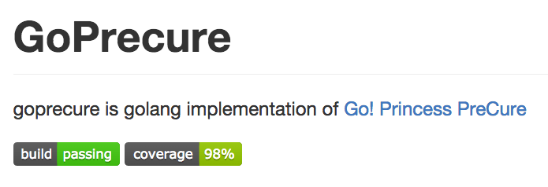
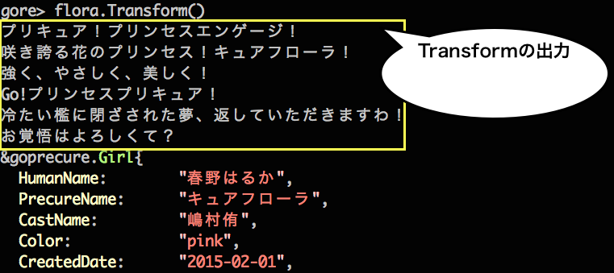

## GoがGoでGo!プリンセスプリキュアを作った
Go Sueyoshi a.k.a sue445

2015/12/06 Go Conference 2015 Winter

（兼 プリキュアAdventCalendar 7日目）

---
## 自己紹介
[](https://twitter.com/sue445)

* Go Sueyoshi a.k.a [@sue445](https://twitter.com/sue445)
  * golang歴 3ヶ月
  * Go歴 33年 (33歳)
  * 「Goのエンジニア」ではなく「エンジニアのGo」です（世間一般的にはRubyist）
  * 【警告】Twitterは上級者向けのアカウントなので決してフォローしないでください！
* Railsの会社でサーバサイド全般を浅く広く見守るお仕事
  * インフラ、アプリ、ライブラリ、社内ツールetc
* 会社ではプリキュアおじさんと呼ばれています

---
## 【今期の嫁】キュアトゥインクル


---
## 【本妻】キュアピース


---
## Agenda
* 「Go!プリンセスプリキュア」とは？
* GoPrecureとは
* 使い方
* 苦労したこと
* 他言語でのプリキュア実装の紹介

---
## 「Go!プリンセスプリキュア」とは
日曜朝8:30からテレビ朝日系で放映しているアニメ

* http://www.toei-anim.co.jp/tv/precure/
* http://asahi.co.jp/precure/princess/


---
## GoPrecureとは
「Go!プリンセスプリキュア」のgolang実装です



https://github.com/sue445/goprecure

---
## 使い方

---
### go getしてimport
```bash
go get github.com/sue445/goprecure
```

```go
import github.com/sue445/goprecure
```

---
### プリキュアのインスタンスを作成
```go
// キュアフローラ
flora := goprecure.NewCureFlora()

// キュアマーメイド
mermaid := goprecure.NewCureMermaid()

// キュアトゥインクル
twinkle := goprecure.NewCureTwinkle()

// キュアスカーレット
scarlett := goprecure.NewCureScarlett()
```

---
### Name で名前を取得
```go
flora := goprecure.NewCureFlora()

flora.Name()
// 春野はるか
```

---
### Transform で変身
```go
flora.Name()
// 春野はるか

flora.Transform()

flora.Name()
// キュアフローラ
```

---
### 実際にはこんな感じ


---
### GoPrecureではフォームチェンジを忠実に再現


---
### 各プリキュアに対応するドレスアップキー
```go
// キュアフローラ
g.DressupKeys = []DressupKey{Flora, Rose, Lily, Sakura, Royal}

// キュアマーメイド
g.DressupKeys = []DressupKey{Mermaid, Ice, Bobble, Sango, Royal}

// キュアトゥインクル
g.DressupKeys = []DressupKey{Twinkle, Luna, ShootingStar, Ginga, Royal}

// キュアスカーレット
g.DressupKeys = []DressupKey{Scarlett, Hanabi, Phoenix, Sun, Royal}
```

---
## 苦労したこと
* GoPrecureに適したREPLがない
  * 4〜5種類くらい使って総合的に [gore](https://github.com/motemen/gore) が一番よかったが、直前までの入力を全部実行しているので標準出力に出力するメソッドとの相性が悪い

---
### 例


---


`Transform` の後に `Exchange` すると `Exchange` の標準出力だけ出してほしいのに直前の `Transform` のも一緒に出るので邪魔

---
golangのREPLがまだGoPrecureに追いついていない感があるｗ

---
## プリキュアの他言語での実装の紹介
* Ruby: [rubicure](https://github.com/sue445/rubicure) (@sue445)
  * GitHubのstarも多いしおそらくこれがたぶん一番有名
* Perl: [Acme::PrettyCure](https://github.com/kan/p5-acme-prettycure) (@kan)
* Python: [pycure](https://github.com/drillbits/pycure) (@drillbits)
* Groovy: [groovycure](https://github.com/ligun/groovycure) (@ligun)
* clojure: [clocure](https://github.com/kaosf/clocure) (@kaosf)

---
## rubicureとGoPrecureの設計思想の違い

---
### rubicureの設計思想
* Rubyの柔軟性を利用してメタプロを大活用
  * クラスにメソッドはほとんど定義せずに `method_missing` でymlに飛ばすとか
* `transform!`（変身） や `attack!`（必殺技） など破壊的メソッドには `!` をつけるRubyの慣習に則った
* 基本的にプリキュア全員対応するため特定のシリーズに特化させない汎用的な設計
* rubicureのおかげでRubyの勉強になった

---
### GoPrecureの設計思想
* 静的型付けを意識した設計
  * `DresupKey` という型を `const` で定義することにより `Exchange` に未知のドレスアップキーが引数がわたらないようにした（コンパイルエラーになる）
* Go!プリンセスプリキュアだけに特化させることでドレスアップキーとモードチェンジを関連付けた実装が実現した
* GoPrecureのおかげでgolangの勉強になった

---
## まとめ
新しい言語を勉強する時は自分の好きなものを実装すると良い。

<!--
  disable uppercase
  via. http://srz-zumix.blogspot.jp/2014/09/revealjs-markdown.html
-->
<style type="text/css">
    .reveal h1,
    .reveal h2,
    .reveal h3,
    .reveal h4,
    .reveal h5,
    .reveal h6 {
      text-transform: none;
    }
</style>
